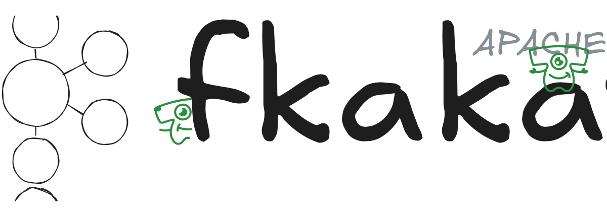

# Курс по Apache Kafka от [Tayviscon IO](https://github.com/tayviscon-io)

**Yet Another Apache Kafka Course** - это курс от компании [Tayviscon IO](https://github.com/tayviscon-io)
из серии «Yet Another Course», рассказывающий об основах такой технологии, как Apache Kafka.
Цель данного курса научить использовать платформу Apache Kafka для передачи и обработки событий реального времени,
а также сделать процессы отслеживания метрик и настройки отказоустойчивого кластера понятными каждому.

## Автор и Контрибьюторы
Данный курс развивается силами сообщества [Tayviscon IO](https://github.com/tayviscon-io).
Большое спасибо [всем](https://github.com/tayviscon-io/yet-another-apache-kafka-course/graphs/contributors),
кто помогает развивать данный проект.

